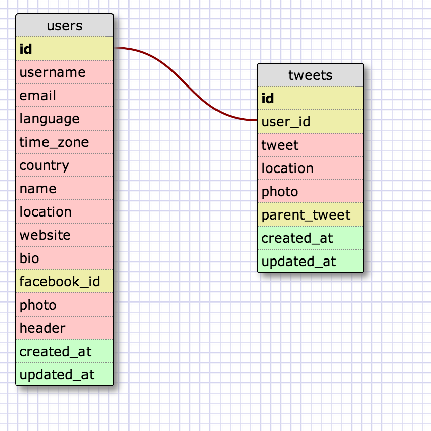

# U3.W7: Modeling a Real-World Database (SOLO CHALLENGE)

## Release 0: Users Fields
<!-- Identify the fields Twitter collects data for -->
Photo
Header

Account related fields - 
Username (twitter handle)
Email
Language
Time zone
Country

User Profile info - 
Name (20 char)
Location
Website
Bio (160 char)
facebook_id

## Release 1: Tweet Fields
<!-- Identify the fields Twitter uses to represent/display a tweet. What are you required or allowed to enter? -->
tweet (140 char)
photo (optional)
location (optional)
parent_tweet (for nesting of replies)

## Release 2: Explain the relationship
The relationship between `users` and `tweets` is: 
A one-to-many relationship.  A user can have many tweets, but one tweet will not have many users.  It will always belong to someone.  
<!-- because... -->

## Release 3: Schema Design
<!-- Include your image (inline) of your schema -->

## Release 4: SQL Statements
<!-- Include your SQL Statements. How can you make markdown files show blocks of code? -->

- all the tweets for a certain user id
select * from tweets
where user_id = 'blah'

- the tweets for a certain user id that were made after last Wednesday (whenever last Wednesday was for you)
select * from tweets
where user_id = "blah" and 
created_at > 04/23/2014

- all the tweets associated with a given user's twitter handle
select tweet, location, photo
from tweets join users on (user_id = id)
where username = 'aki'

- the twitter handle associated with a given tweet id 
select username from users
where id = 'blah'

## Release 5: Reflection
<!-- Be sure to add your reflection here!!! -->
Felt like this was a fairly easy to understand exercise.  While designing the users table, felt like I should be breaking out that table further since there are a lot of fields.  For example, was thinking that it would make sense to break out account vs. public profile related items so data is easier to manage.  I would assume that would be a good direction to go and expect to use joins where an if needed in SQL. 

