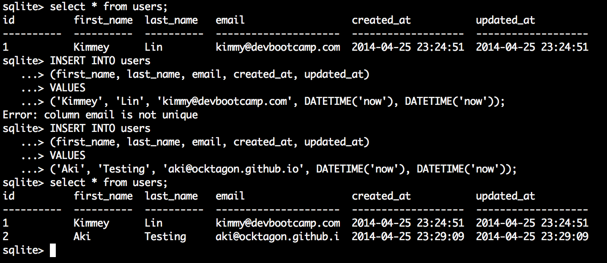

# U3.W7: Intro to SQLite

## Release 0: Create a dummy database

<!-- paste your terminal output here -->

## Release 1: Insert Data 
<!-- paste your terminal output here -->

## Release 2: Multi-line commands
<!-- paste your terminal output here -->

## Release 3: Add a column
<!-- paste your terminal output here -->
 

## Release 4: Change a value
<!-- paste your terminal output here -->

## Release 5: Reflect
<!-- Add your reflection here -->
Learning basic commands on sqlite was easy after learning sql commands early on.  As for syntax, it's really hard to memorize all of this so I'm having trouble with that.  

I am worried that I don't yet know how to manipulate
big data dumps, and would like to learn that sooner than later as that would be a common task when using sqlite.  

